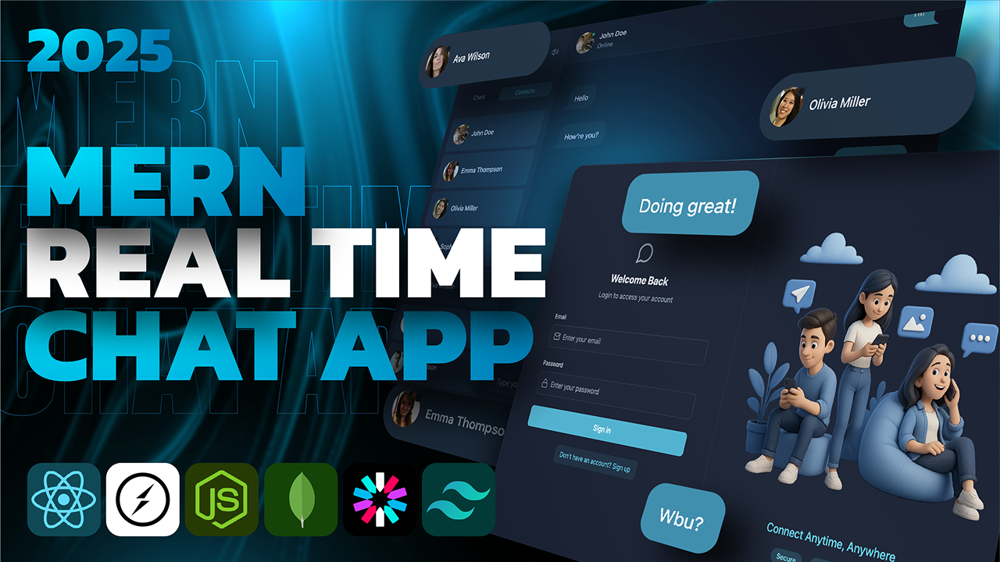

<h1 align="center">💬 Tingl – Full Stack Real-Time Chat Application 🚀</h1>

<p align="center">
A modern full-stack chat application built with the MERN stack, featuring real-time messaging, authentication, email integration, and cloud storage.
</p>

---

## 📸 Demo



---

## ✨ Features

### 🔐 Authentication
- Custom JWT-based authentication (no third-party auth)
- Secure password hashing
- Protected routes

### 💬 Real-Time Chat
- Instant messaging powered by Socket.io
- Online / Offline presence indicators
- Auto-scroll to latest message
- Typing & notification sounds (with toggle)

### 📨 Email Integration
- Welcome emails on signup (Resend API)
- Clean HTML email templates

### 🖼 Media Support
- Image uploads via Cloudinary
- Image preview before sending

### 🛡 Security & Performance
- RESTful API built with Node.js & Express
- MongoDB for persistent storage
- API rate limiting via Arcjet
- Environment-based configuration

### 🎨 Frontend
- React + Vite
- Tailwind CSS for styling
- DaisyUI components
- Zustand for global state management
- Responsive modern UI

### 🚀 Deployment Ready
- Free-tier friendly
- Easily deployable backend & frontend separately

---

# 🛠 Tech Stack

### Frontend
- React
- Vite
- Tailwind CSS
- Zustand
- Socket.io Client

### Backend
- Node.js
- Express
- MongoDB (Mongoose)
- Socket.io
- JWT
- Resend (Emails)
- Cloudinary (Image Uploads)
- Arcjet (Rate Limiting)

---
### 🔮 Future Implementations
📞 Audio & Video Calling

WebRTC-based peer-to-peer audio calls

Video calling with camera & microphone controls

Call accept / reject functionality

Call status indicators (ringing, connected, ended)

🔎 Search Improvements

Search users by email

Real-time search suggestions

Filter chats by name or email

Recent search history

📂 File Sharing

PDF and document sharing

File preview support

Drag & drop uploads

🟢 Advanced Presence System

Last seen timestamps

Custom status messages (Busy, Away, Available)

🔔 Advanced Notifications

Push notifications (PWA support)

In-app message alerts

Mention tagging (@username)

👥 Group Chat Enhancements

Create & manage group chats

Admin roles in groups

Group media sharing

# ⚙️ Environment Variables Setup

---

## 🔙 Backend (`/backend/.env`)

```env
PORT=3000
MONGO_URI=your_mongo_uri_here

NODE_ENV=development

JWT_SECRET=your_jwt_secret

# Email (Optional)
RESEND_API_KEY=your_resend_api_key
EMAIL_FROM=onboarding@resend.dev
EMAIL_FROM_NAME=Tingl

CLIENT_URL=http://localhost:5173

# Cloudinary (Image Uploads)
CLOUDINARY_CLOUD_NAME=your_cloudinary_cloud_name
CLOUDINARY_API_KEY=your_cloudinary_api_key
CLOUDINARY_API_SECRET=your_cloudinary_api_secret

# Rate Limiting
ARCJET_KEY=your_arcjet_key
ARCJET_ENV=development